#  Expense Tracker App

A full-stack **Expense Tracking Web Application** built with Java EE technologies, featuring user authentication, expense management, and a complete admin dashboard. Deployed on **AWS EC2** with **Apache reverse proxy** and **PostgreSQL on Amazon RDS**.

---

##  Live Demo

> Deployed on AWS EC2 (Ubuntu) with Apache HTTP Server as reverse proxy to Apache Tomcat.  
> *(Deployment may be taken down after project presentation)*

---

##  Features

###  Authentication
- User **Signup & Login** with session management
- Secure password handling
- Session-based access control

###  Expense Dashboard
- Add, view, and manage personal expenses
- Track transactions with categories and amounts
- Visual expense summary dashboard

###  Admin / User Management
- View all registered users
- **Add / Edit / Delete** user accounts
- **Ban / Unban** users
- Full CRUD operations on user accounts

---
##  Application Screenshots

###  Authentication
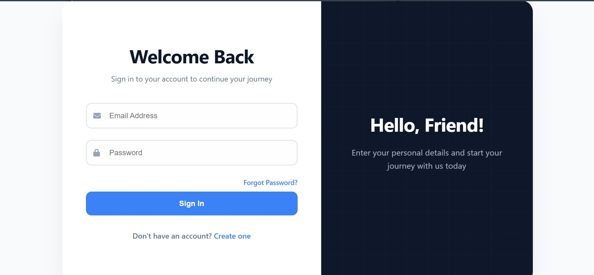

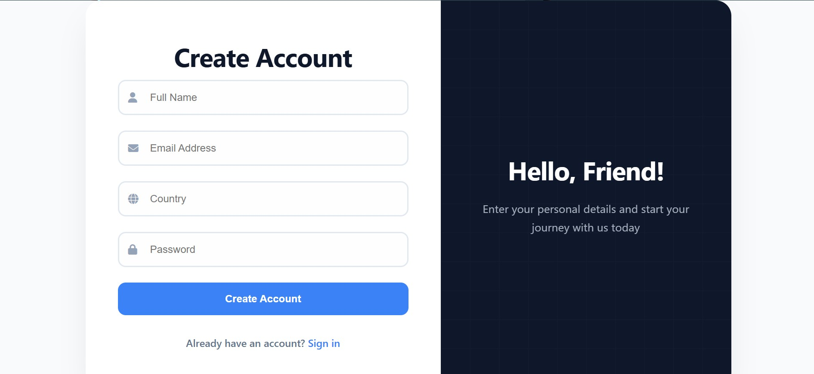

###  Dashboard
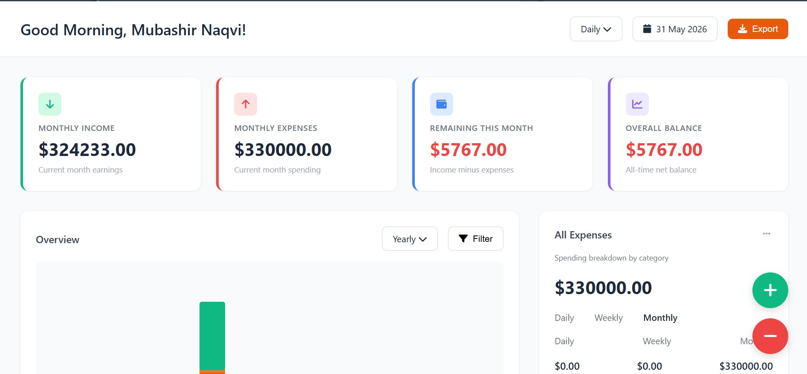

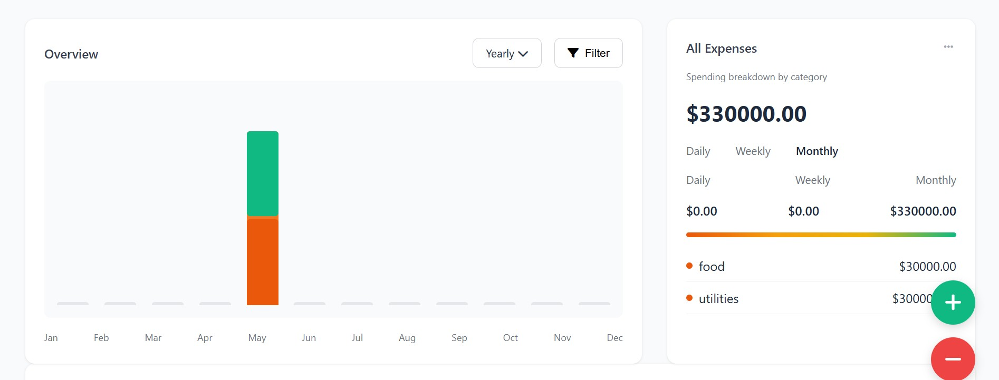

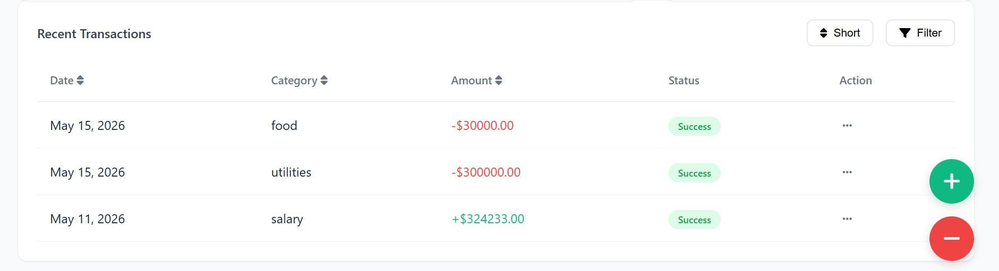

###  Expense Management
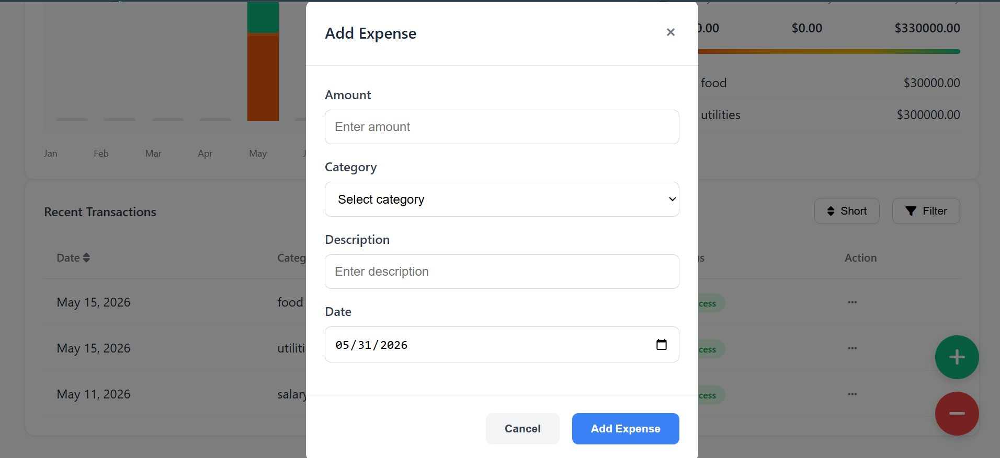

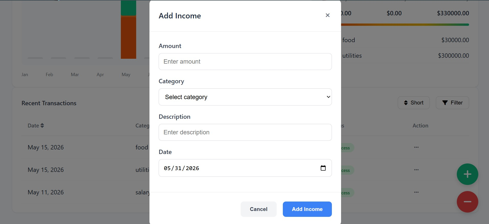

###  Admin Panel
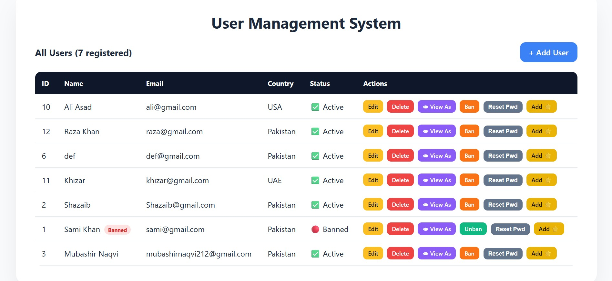

##  Tech Stack

| Layer | Technology |
|---|---|
| Language | Java 17 |
| Web Layer | Java Servlets, JSP |
| ORM | Hibernate 6 / JPA |
| Database | PostgreSQL |
| Build Tool | Maven |
| App Server | Apache Tomcat 10 |
| Web Server | Apache HTTP Server (Reverse Proxy) |
| Cloud | AWS EC2, AWS RDS, AWS VPC |
| OS | Ubuntu 26.04 LTS |

---

##  AWS Infrastructure

```
Browser
   ↓
Apache HTTP Server (Port 80) ← Reverse Proxy
   ↓
Apache Tomcat (Port 8080)
   ↓
AWS RDS PostgreSQL (Private Subnet)
   ↑
AWS VPC (Public + Private Subnets)
```

### Infrastructure Setup
- **VPC** with public and private subnets across multiple availability zones
- **EC2 instance** (Ubuntu) in public subnet running Tomcat + Apache
- **RDS PostgreSQL** in private subnet — not publicly accessible
- **Internet Gateway** + custom route tables for secure traffic routing
- **Security Groups** configured to allow only necessary traffic
- **Apache reverse proxy** forwarding port 80 → 8080

---

## 📁 Project Structure

```
src/
└── main/
    ├── java/
    │   └── com/example/assignment02/
    │       ├── dao/          # Data Access Layer (DAO Pattern)
    │       ├── model/        # Entity classes (User, Expense, Transaction)
    │       ├── servlet/      # HTTP Servlets (Login, Dashboard, Transactions)
    │       └── web/          # Web Servlets (Signup, User Management)
    ├── resources/
    │   └── META-INF/
    │       └── persistence.xml.template  # DB config template
    └── webapp/
        ├── WEB-INF/
        │   └── web.xml
        ├── dashboard.jsp
        ├── login.html
        ├── login.jsp
        ├── user-form.jsp
        └── user-list.jsp
```

---

## ☁️ AWS Infrastructure

###  Architecture Diagram
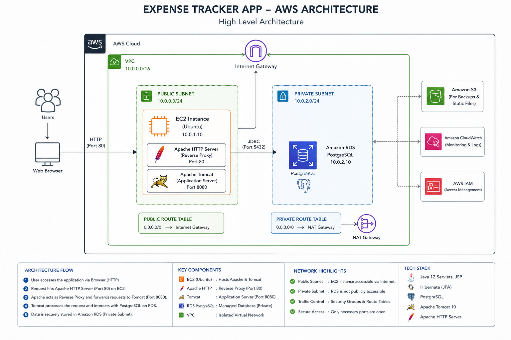

###  EC2 Instance
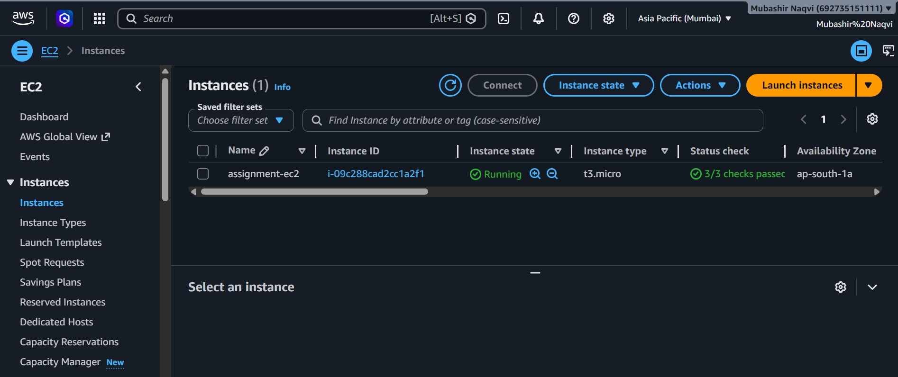
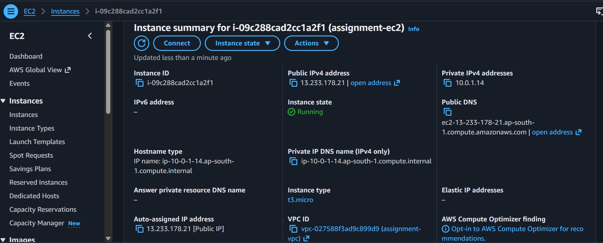

###  RDS Database
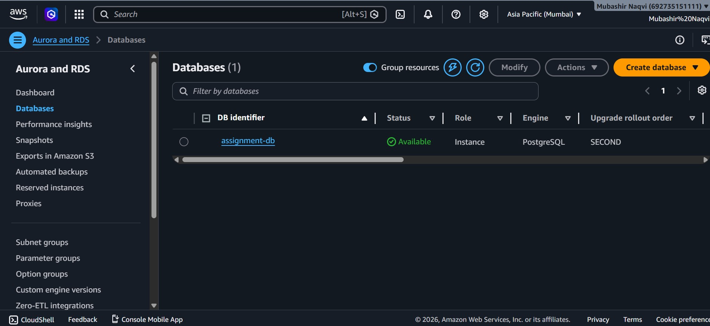
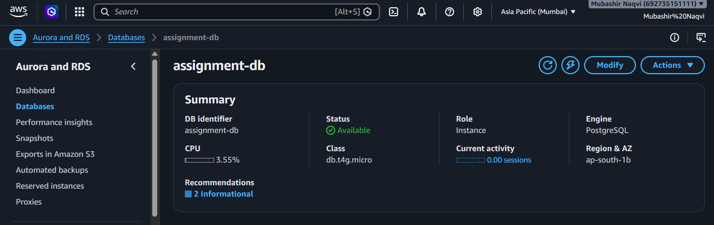

###  Security Groups
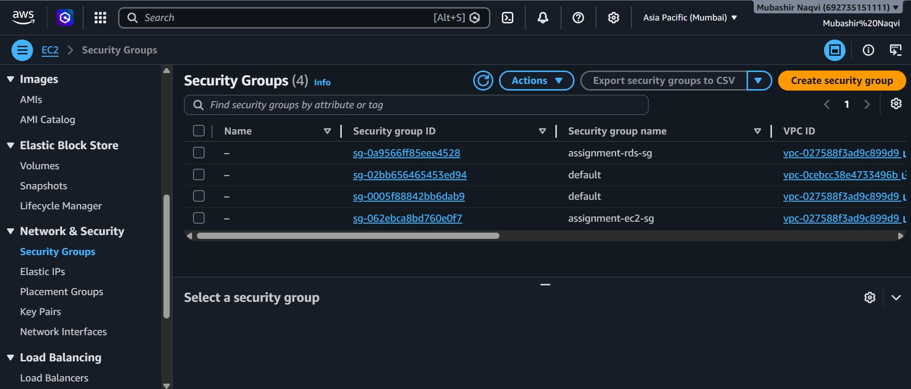

###  VPC Setup
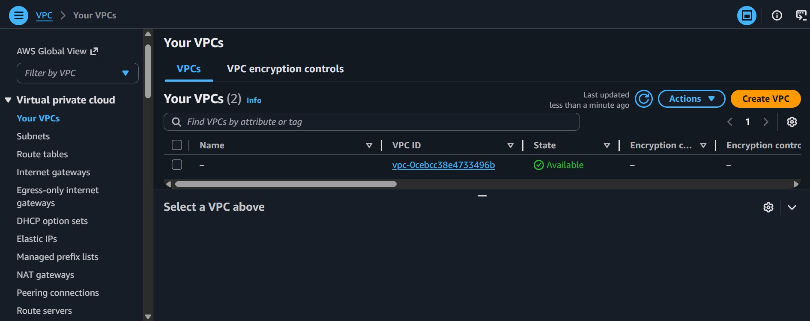
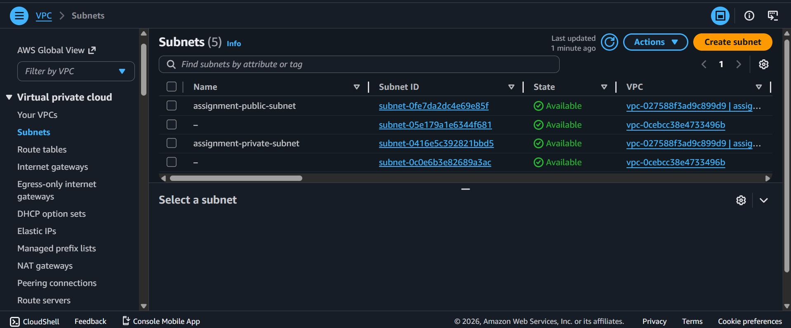
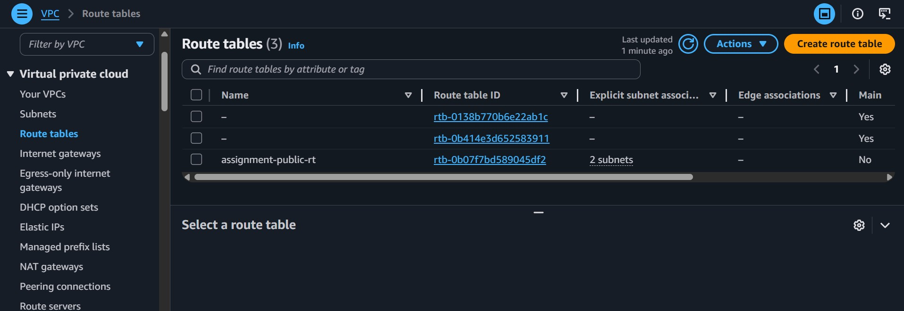

##  Local Setup

### Prerequisites
- Java 17+
- Maven 3.8+
- PostgreSQL installed and running
- Apache Tomcat 10

### Steps

**1. Clone the repository**
```bash
git clone https://github.com/mubashirnaqvi212/expense-tracker-app.git
cd expense-tracker-app
```

**2. Set up the database**
```sql
CREATE DATABASE expense_db;
CREATE USER your_user WITH PASSWORD 'your_password';
GRANT ALL PRIVILEGES ON DATABASE expense_db TO your_user;
```

**3. Configure database connection**

Copy the template and fill in your credentials:
```bash
cp src/main/resources/META-INF/persistence.xml.template \
   src/main/resources/META-INF/persistence.xml
```

Edit `persistence.xml` with your database details:
```xml
<property name="jakarta.persistence.jdbc.url"
          value="jdbc:postgresql://localhost:5432/expense_db"/>
<property name="jakarta.persistence.jdbc.user" value="your_user"/>
<property name="jakarta.persistence.jdbc.password" value="your_password"/>
```

**4. Build the WAR file**
```bash
mvn clean package
```

**5. Deploy to Tomcat**

Copy the WAR to your Tomcat webapps directory:
```bash
cp target/Assignment02-1.0-SNAPSHOT.war /opt/tomcat/webapps/Assignment02.war
```

**6. Access the app**
```
http://localhost:8080/Assignment02/users
```

---

##  Deployment on Linux (AWS EC2)

### Install Java & Tomcat
```bash
sudo apt update
sudo apt install openjdk-17-jdk -y
cd /opt && sudo wget https://archive.apache.org/dist/tomcat/tomcat-10/v10.1.24/bin/apache-tomcat-10.1.24.tar.gz
sudo tar -xvzf apache-tomcat-10.1.24.tar.gz
sudo mv apache-tomcat-10.1.24 tomcat
sudo /opt/tomcat/bin/startup.sh
```

### Set up Apache Reverse Proxy
```bash
sudo apt install apache2 -y
sudo a2enmod proxy proxy_http
sudo nano /etc/apache2/sites-available/000-default.conf
```

Add inside `<VirtualHost *:80>`:
```apache
ProxyPreserveHost On
ProxyPass /Assignment02 http://localhost:8080/Assignment02
ProxyPassReverse /Assignment02 http://localhost:8080/Assignment02
```

```bash
sudo systemctl restart apache2
```

### Access via reverse proxy
```
http://your-ec2-ip/Assignment02/users
```

---

## 📋 Key Learning Outcomes

- Built a complete **MVC architecture** using Java Servlets and JSP
- Implemented **JPA/Hibernate** ORM with PostgreSQL
- Applied **DAO design pattern** for clean data access separation
- Configured **AWS VPC** with public/private subnet architecture
- Set up **Apache HTTP Server as reverse proxy** to Tomcat
- Managed **Linux server** via SSH (file permissions, services, deployment)
- Deployed production **WAR file** to cloud server
- Worked with **Amazon RDS** in a private subnet for secure database hosting

---

##  License

This project is open source and available under the [MIT License](LICENSE).

---

## Author

<p align="left">
  
  <b> Mubashir Naqvi</b>
</p>

<p align="left">
  <a href="https://github.com/mubashirnaqvi212">
    
  </a>
</p>
